# Mermaid

## Flowchart

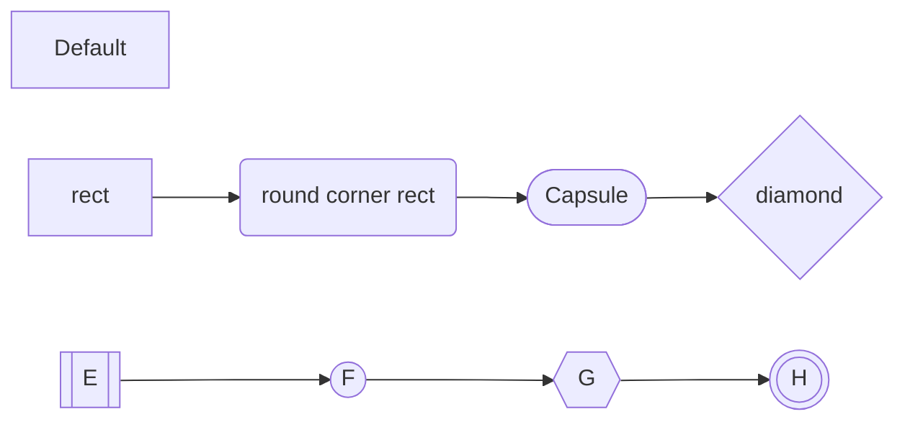

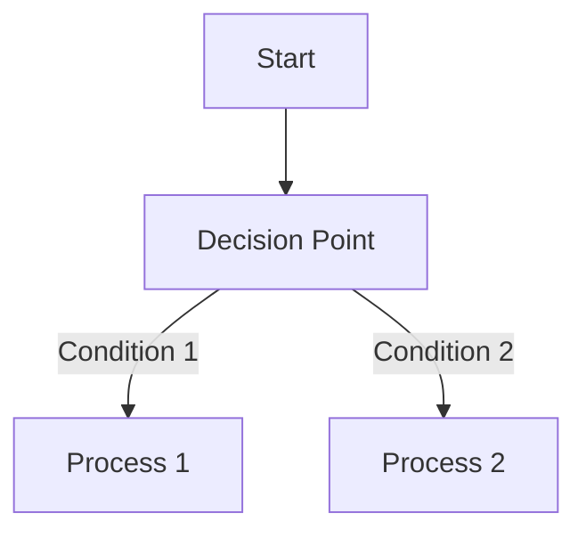

## Sequence Diagram

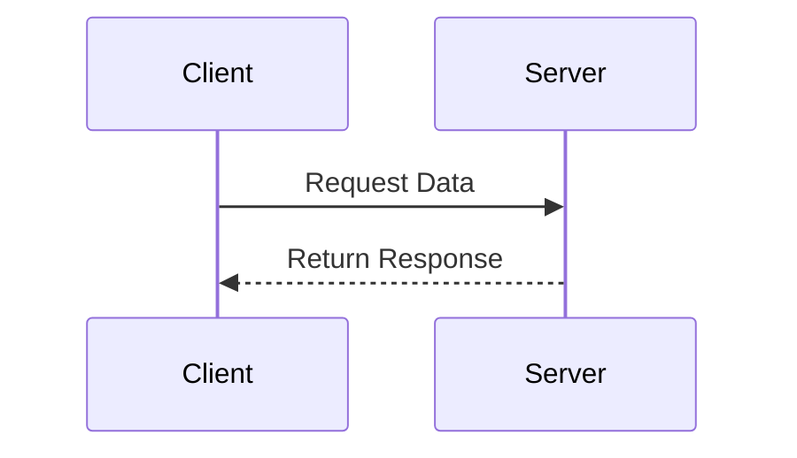

### Basic Syntax Elements

#### Participants

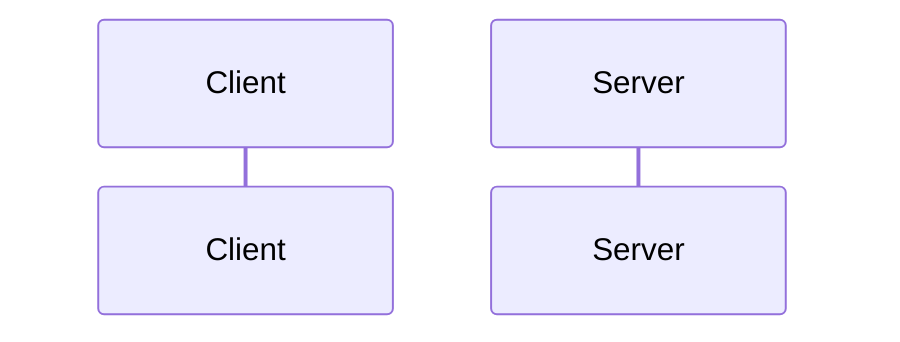

#### Message Types

Lines:

- `-` solid line
- `-` dashed line

Arrows:

- `->` no arrow
- `->>` arrow
- `-x` cross line
- `-)` open

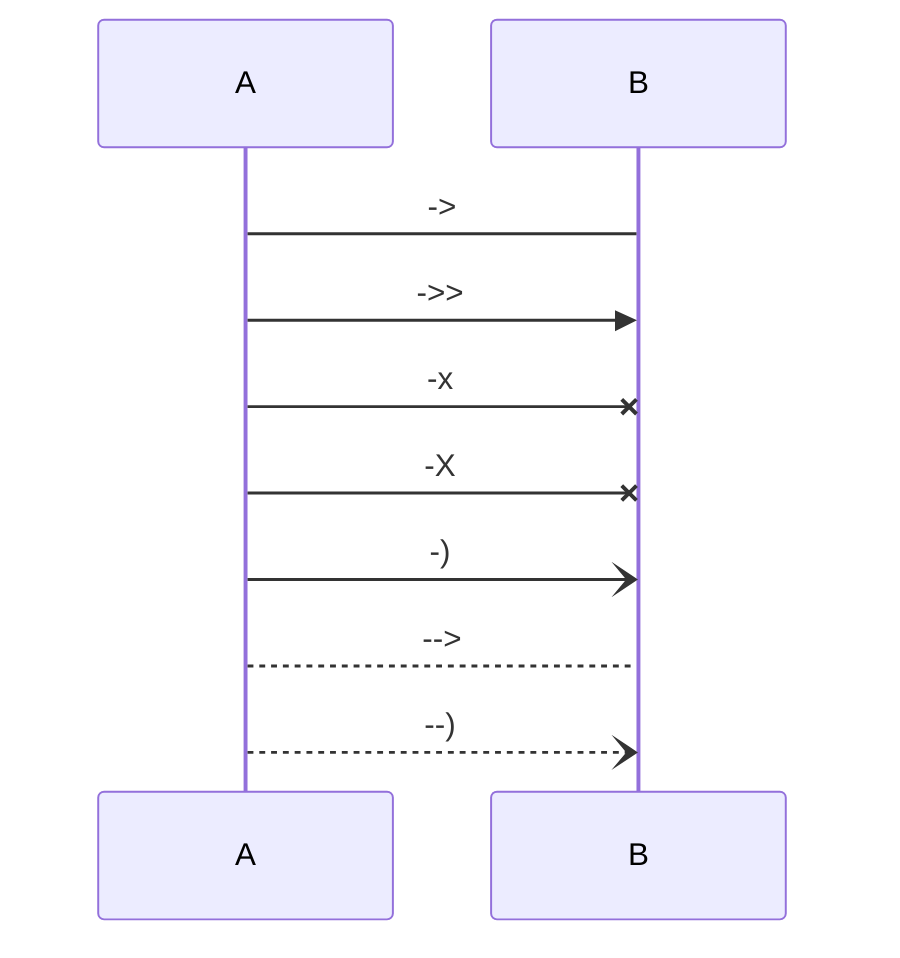

#### Activation Boxes

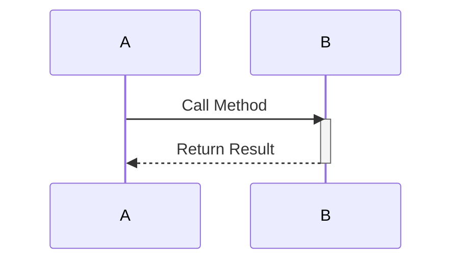

#### Advanced Features

##### Conditional Logic

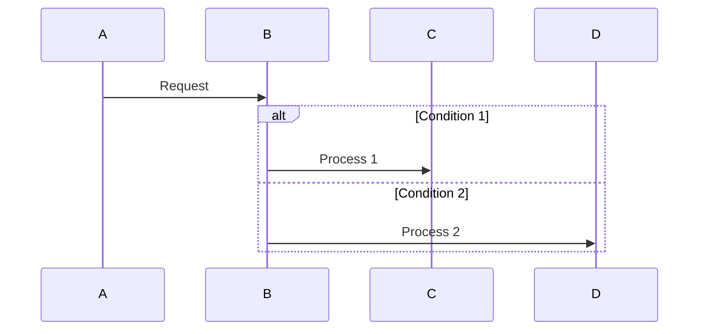

##### Loop Structure

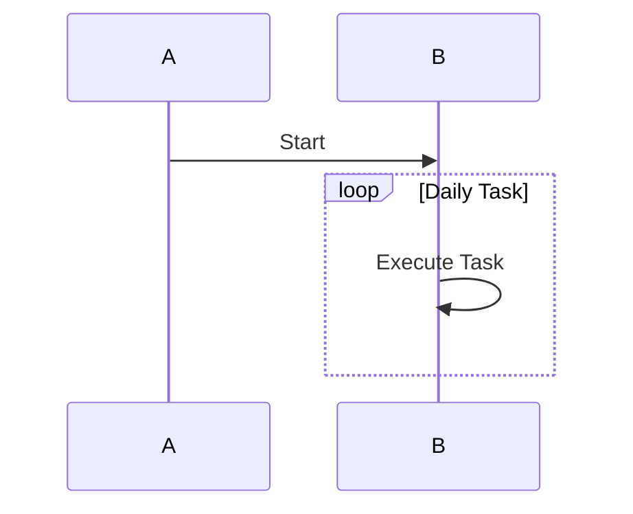

##### Note

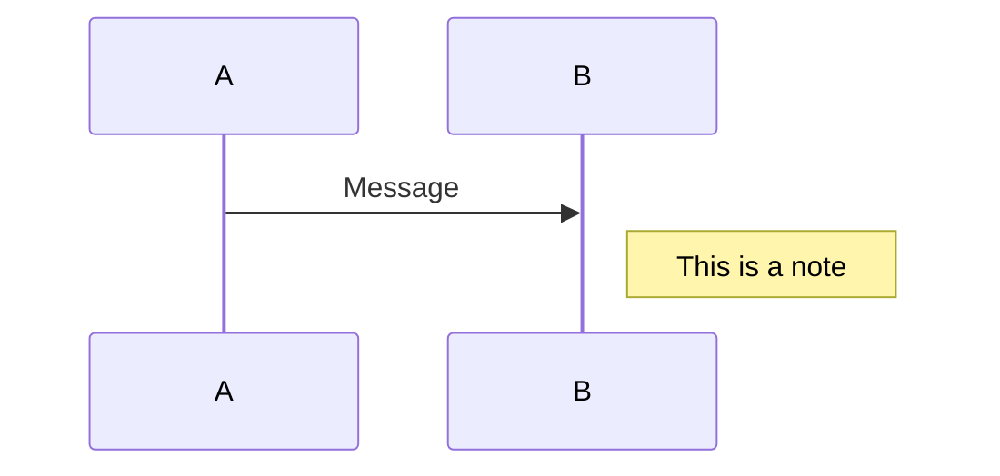

## Gantt Diagram

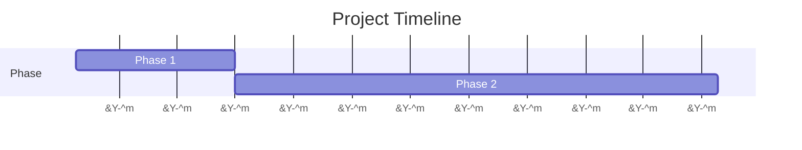

## Class Diagram

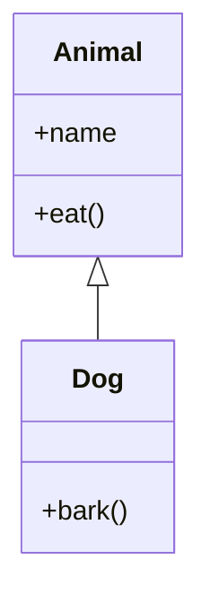

## State Diagram

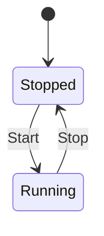

## Pie Chart

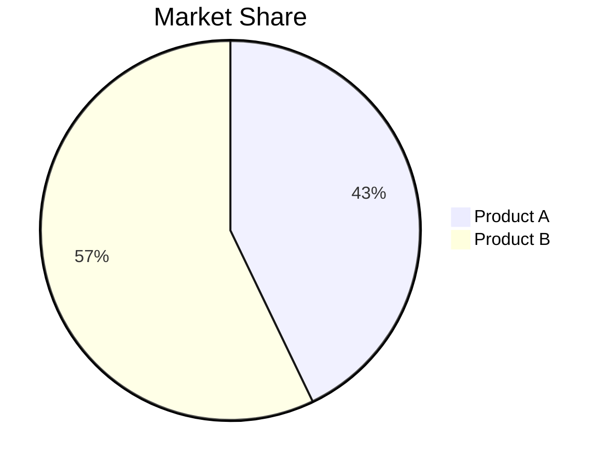

## Git Graph

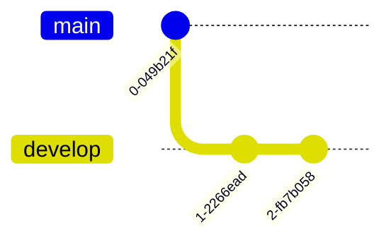

## Entity Relationship Diagram (ER Diagram)

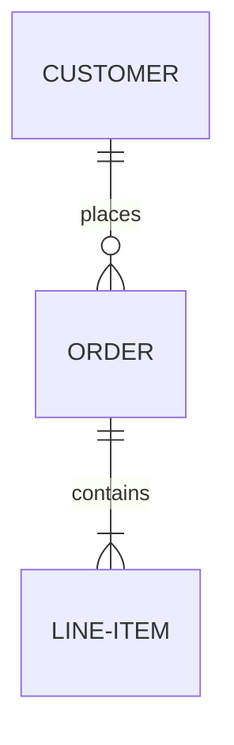
