# Mermaid

## 流程图 (Flowchart)

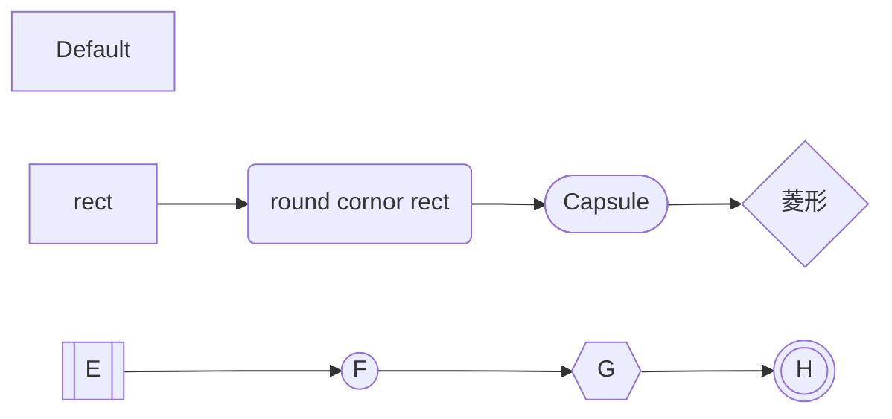

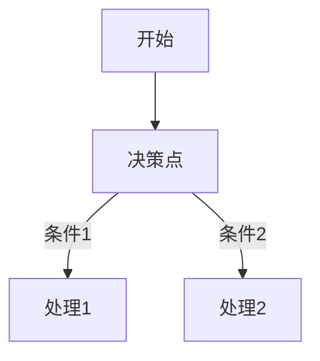

## 序列图 (Sequence Diagram)

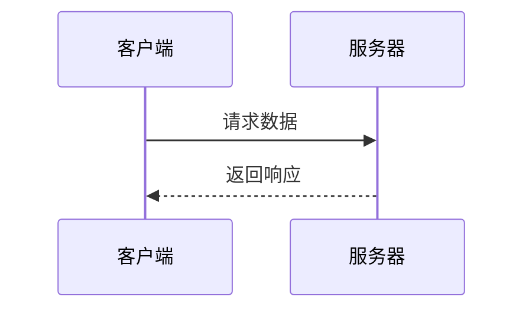

### 基本语法元素

#### 参与者（Participants）

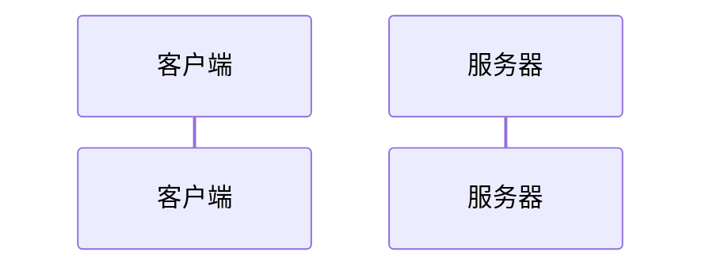

#### 消息类型

线条：

- `-` 实线
- `--` 虚线

箭头：

- `->` 无箭头
- `->>` 箭头
- `-x` 叉线
- `-)` 开放

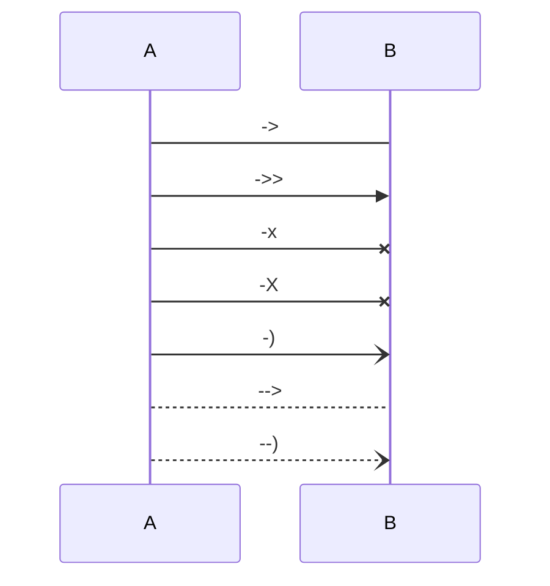

#### 激活框（Activation Boxes）

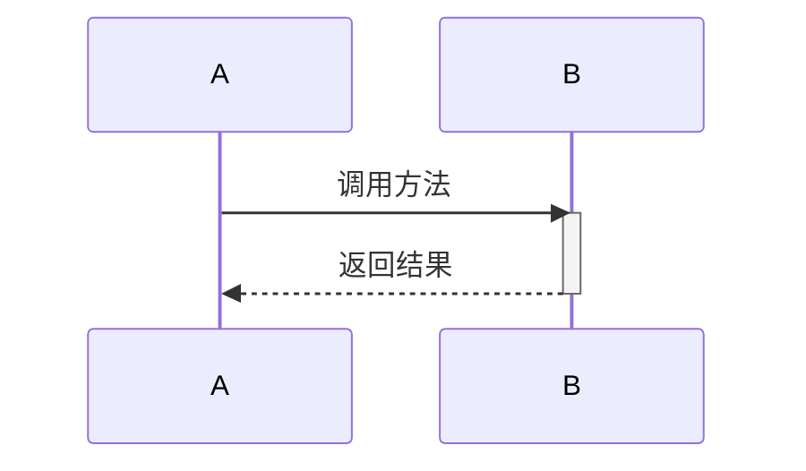

#### 高级功能

##### 条件逻辑

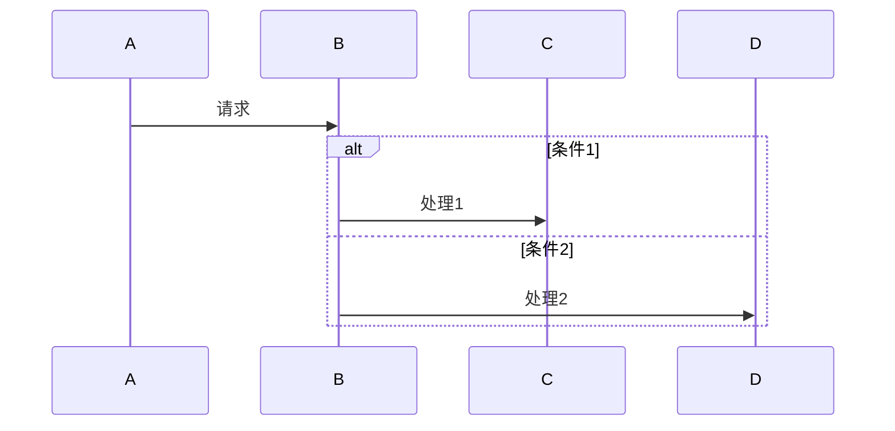

##### 循环结构

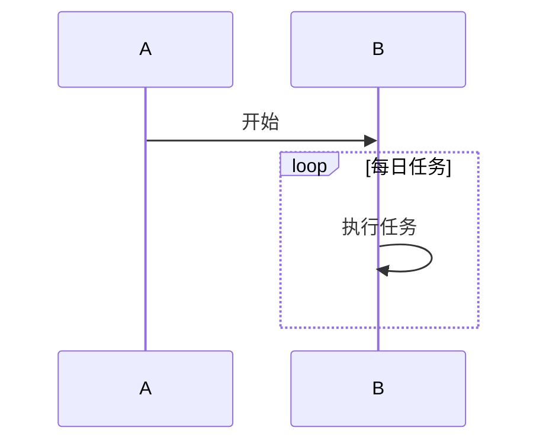

##### 注释

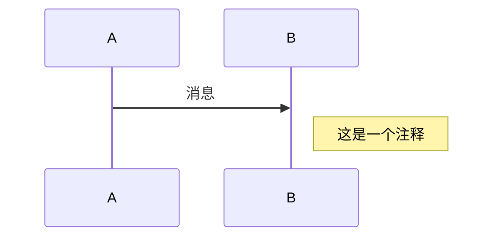

## 甘特图 (Gantt Diagram)

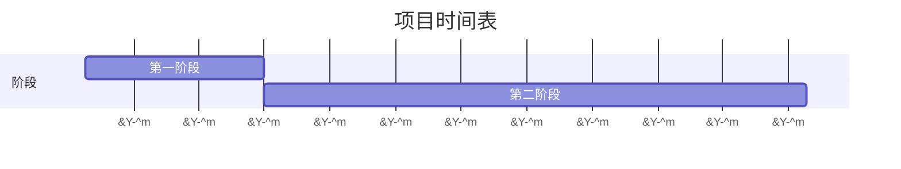

## 类图 (Class Diagram)

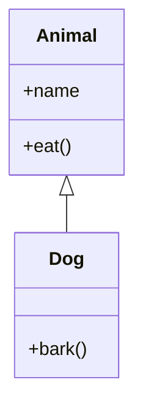

## 状态图 (State Diagram)

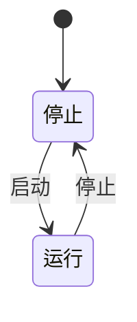

## 饼图 (Pie Chart)

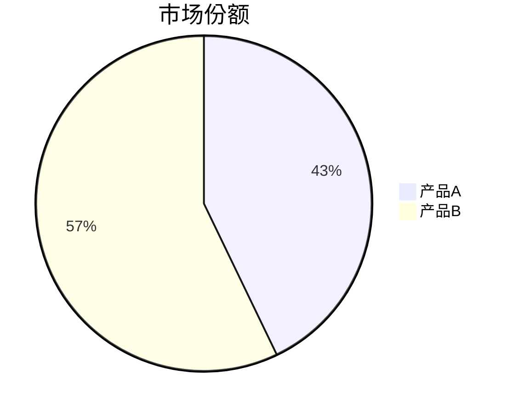

## Git 图 (Git Graph)

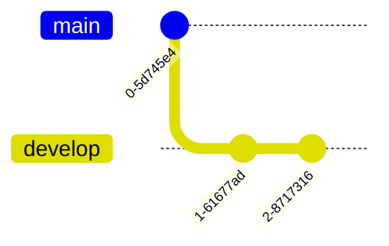

## 实体关系图 (ER Diagram)

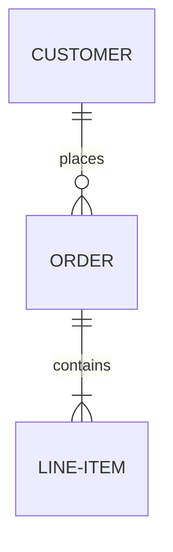
